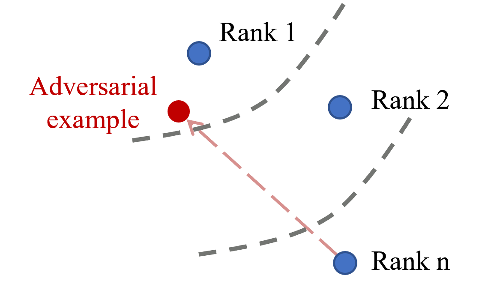

# PIAT
This is the code and Theorem for the paper "Perturbation-Invariant Adversarial Training for Neural Ranking Models: Improving the Effectiveness-Robustness Trade-Off".

## Introduction



Neural ranking models (NRMs) have shown great success in information retrieval (IR). But their predictions can easily be manipulated using adversarial examples, which are crafted by adding imperceptible perturbations to legitimate documents. This vulnerability raises significant concerns about their reliability and hinders the widespread deployment of NRMs. By incorporating adversarial examples into training data, adversarial training has become the de facto defense approach to adversarial attacks against NRMs. However, this defense mechanism is subject to a trade-off between effectiveness and adversarial robustness. 

In this study, we establish theoretical guarantees regarding the effectiveness-robustness trade-off in NRMs. We decompose the robust ranking error into two components, i.e., a *natural ranking error* for effectiveness evaluation and a *boundary ranking error* for assessing adversarial robustness. Then, we define the *perturbation invariance* of a ranking model and prove it to be a differentiable upper bound on the boundary ranking error for attainable computation. Informed by our theoretical analysis, we design a novel *perturbation-invariant adversarial training* (PIAT) method for ranking models to achieve a better effectiveness-robustness trade-off. We design a regularized surrogate loss, in which one term encourages the effectiveness to be maximized while the regularization term encourages the output to be smooth, so as to improve adversarial robustness. Experimental results on several ranking models demonstrate the superiority of PITA compared to existing adversarial defenses. 

## Acknowledgement

- [TRADES](https://github.com/yaodongyu/TRADES)
- [PRADA](https://github.com/wuchen95/PRADA)
- [RankGPT](https://github.com/sunnweiwei/RankGPT)

## License

This project is under Apache License 2.0.

## Citation

If you find our work useful, please consider citing our paper:
```
@inproceedings{liu2024perturbation,
  title={Perturbation-Invariant Adversarial Training for Neural Ranking Models: Improving the Effectiveness-Robustness Trade-Off},
  author={Liu, Yu-An and Zhang, Ruqing and Zhang, Mingkun and Chen, Wei and de Rijke, Maarten and Guo, Jiafeng and Cheng, Xueqi},
  booktitle={Proceedings of the AAAI Conference on Artificial Intelligence},
  volume={38},
  pages = {8832-8840},
  year={2024}
}
```
